# Fictional Character Creator: The Story Behind the Code

This document explains how our Fictional Character Creator MVP works, highlighting the interactions between different components and the flow of data through the system.

## System Overview

The Fictional Character Creator is a web application that allows users to:

1. Create fictional characters with detailed text descriptions
2. Generate character portraits using OpenAI's DALL-E 3 API
3. Create variations of characters with different poses, expressions, and settings
4. View, manage, and delete characters and their variations

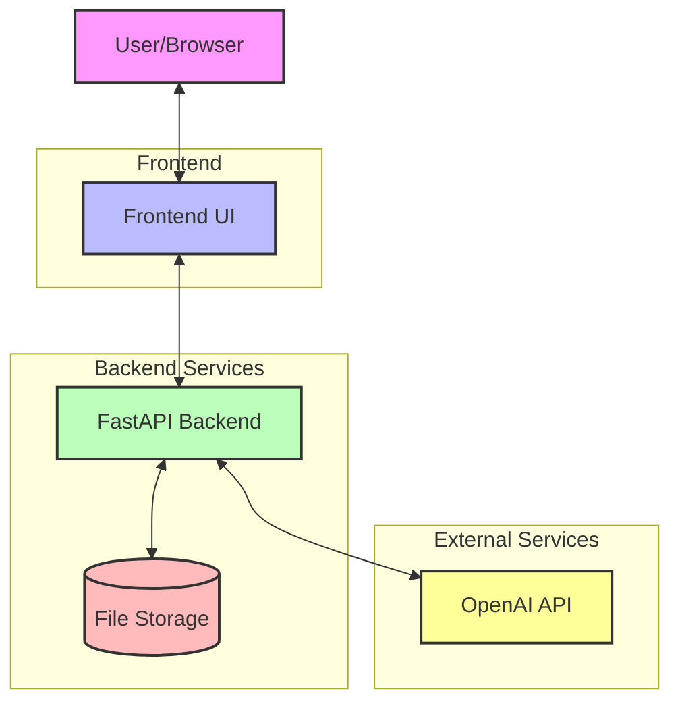

## Architecture

The application follows a layered architecture pattern:

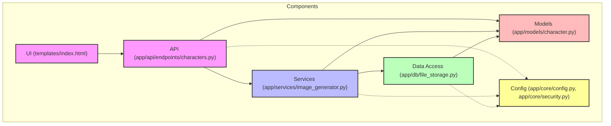

### Key Components:

1. **Frontend UI**: Single HTML page with Bootstrap and vanilla JavaScript that provides the user interface.
2. **API Layer**: FastAPI endpoints that handle HTTP requests and responses.
3. **Services Layer**: Business logic for generating images using OpenAI.
4. **Data Access Layer**: Handles saving and retrieving character data from JSON file storage.
5. **Data Models**: Pydantic models that define the structure of characters and variations.
6. **Configuration**: Environment variables and settings for the application.

## Character Creation Flow

When a user creates a new character, the following sequence of events occurs:

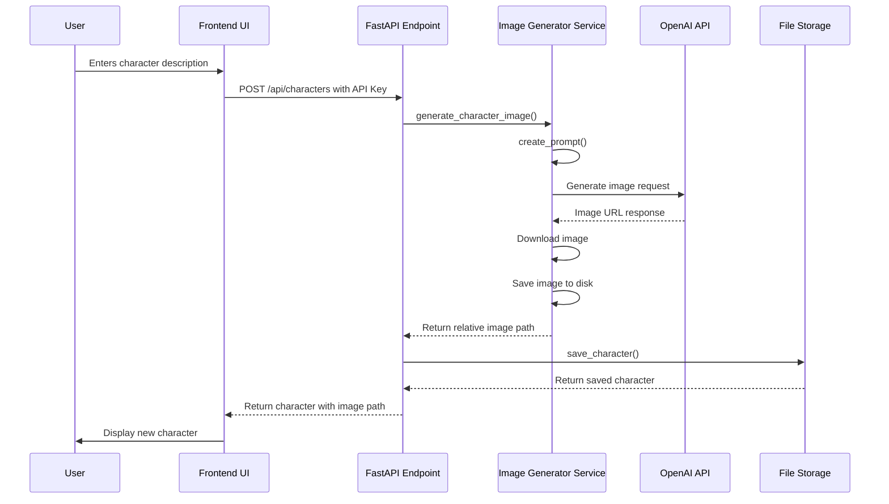

## Variation Creation Flow

When a user creates a variation of an existing character:

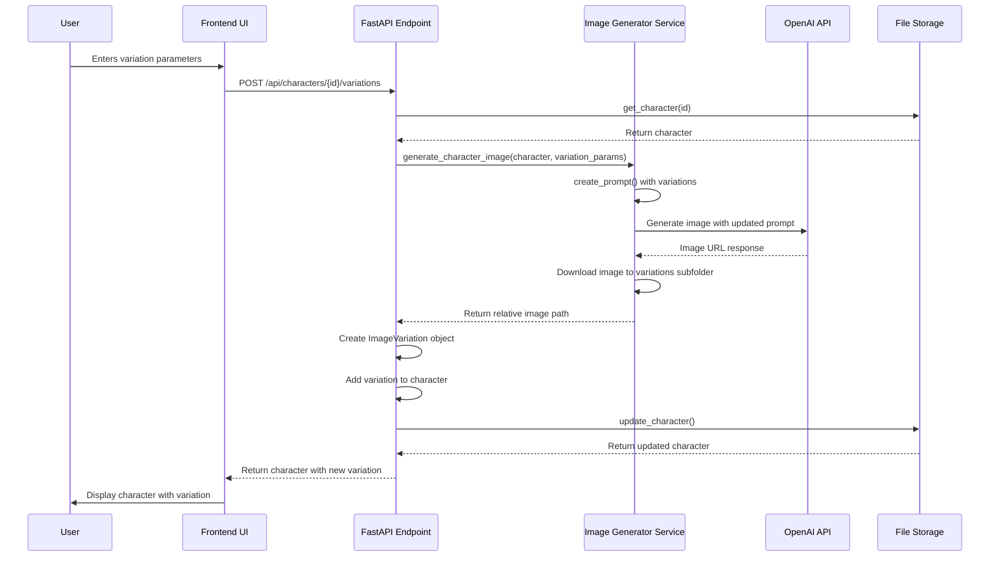

## Security Flow

All API endpoints are protected by an API key:

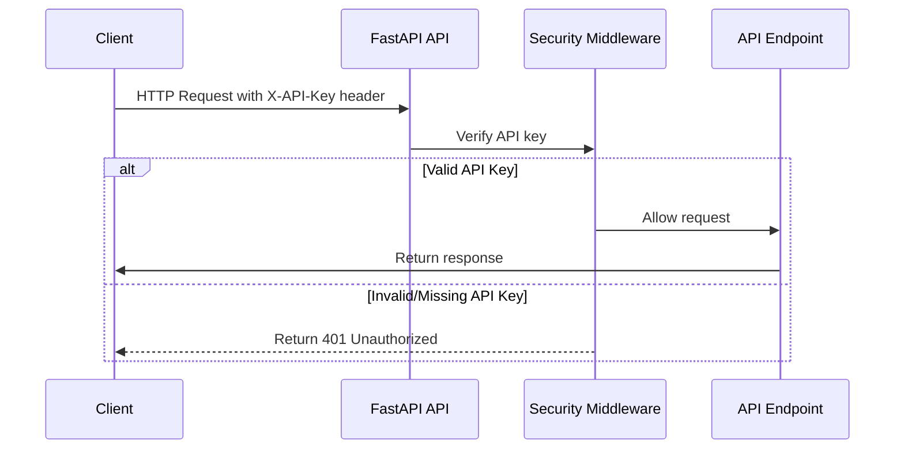

## Data Model

The application uses Pydantic models to define the structure of characters and variations:

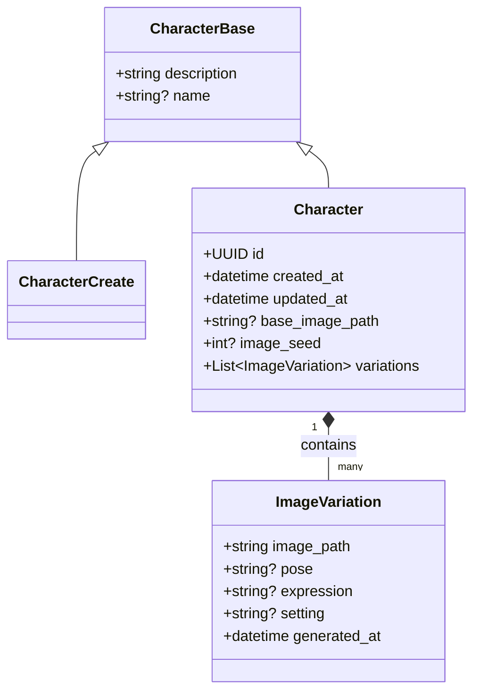

## File Storage Implementation

The application uses a simple JSON file-based storage system:

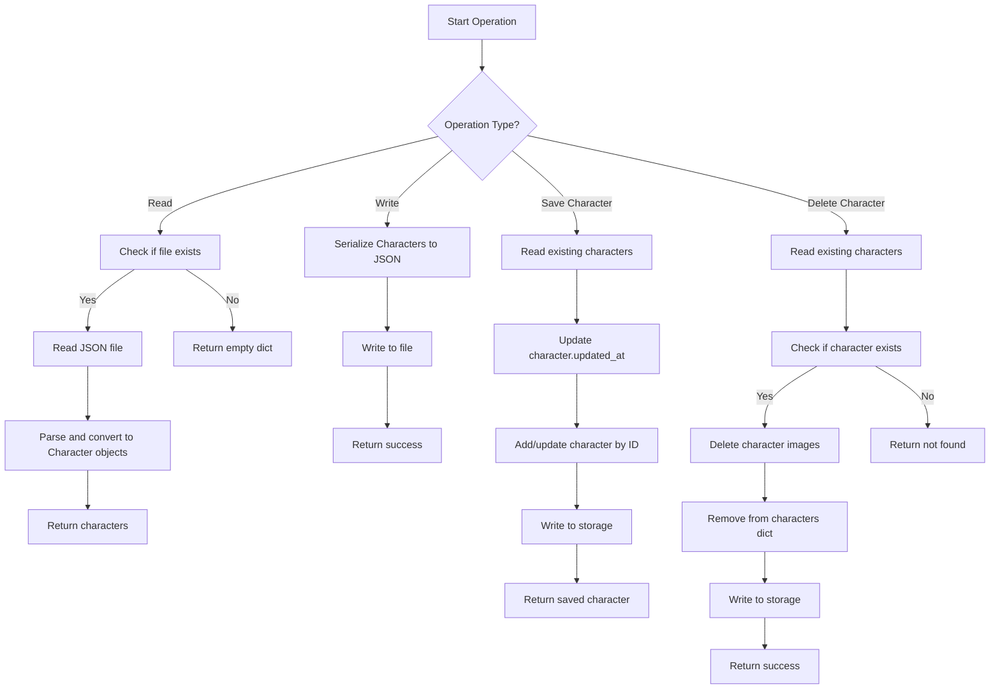

## OpenAI Integration Flow

The image generation service interacts with OpenAI's API:

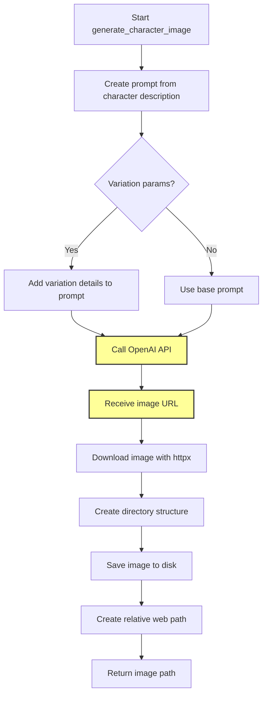

## Image Consistency Approach

To strive for character appearance consistency across variations, the application implements a prompt-based consistency approach:

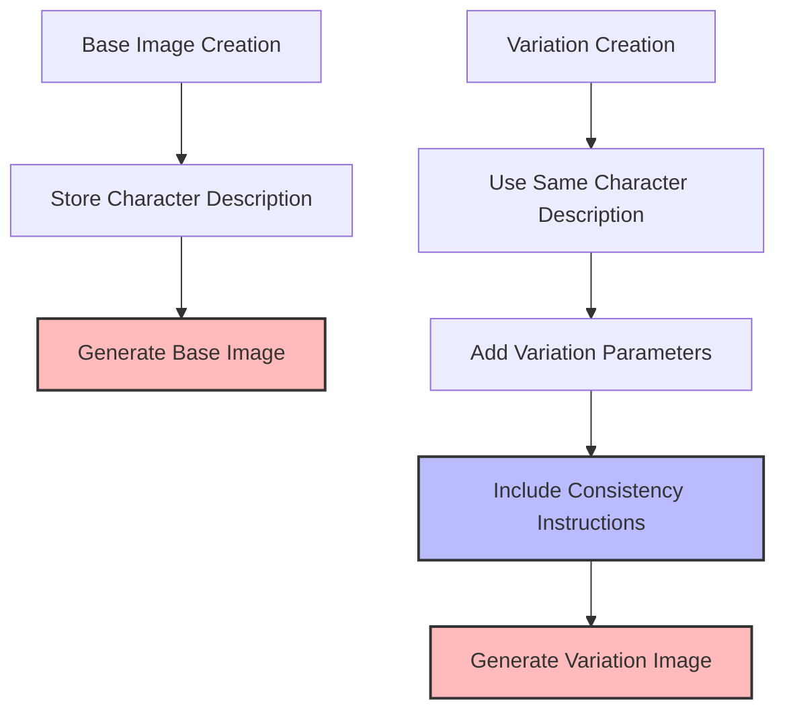

The consistency mechanism works as follows:

1. The system stores the character's description and maintains it across all variations
2. For variations, the system extends the base prompt with specific variation parameters
3. All prompts include explicit instructions to "maintain a consistent appearance for the character's core features"
4. The application is designed to work with future API versions that may support the seed parameter

Note: The system also stores a seed value in anticipation of future API versions that will support the seed parameter for deterministic image generation.

## Frontend Architecture

The frontend uses vanilla JavaScript with bootstrap for UI components:

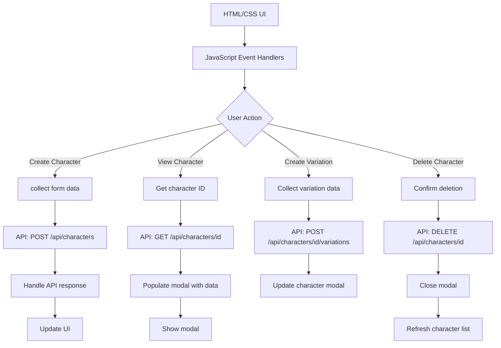

## API Endpoint Structure

The REST API provides the following endpoints:

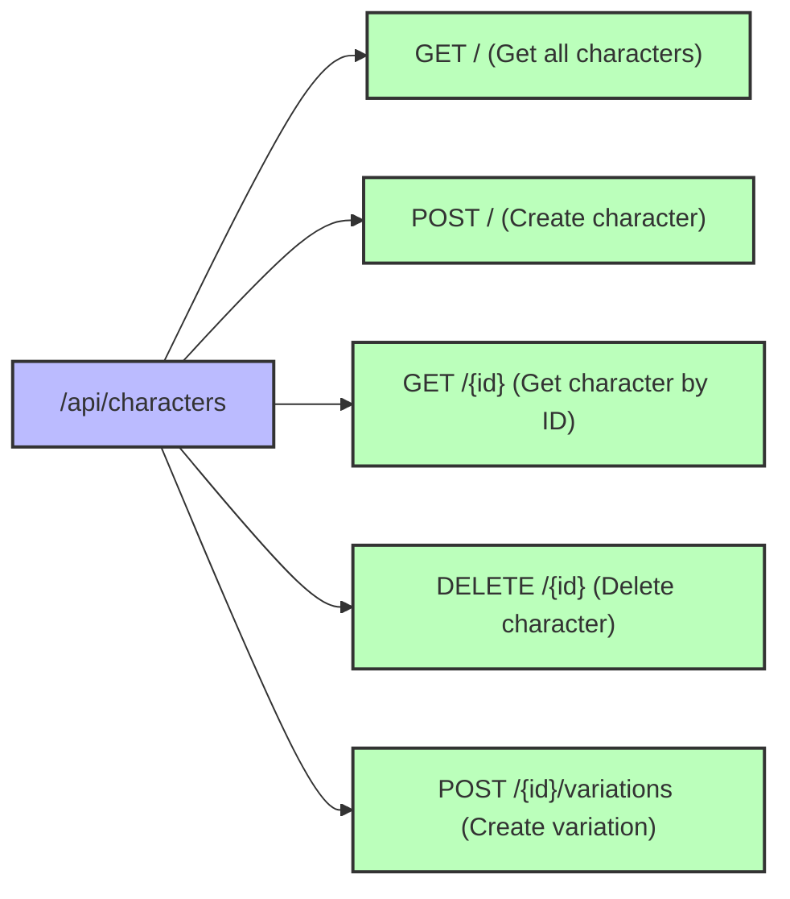

## Configuration & Environment Variables

The application uses environment variables from a `.env` file:

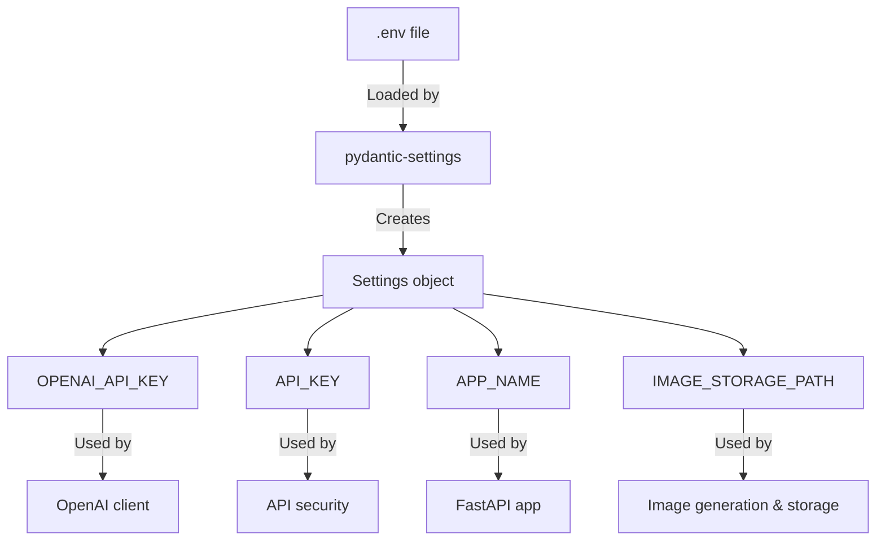

## Storage Locations

Both character data and generated images are stored on disk:

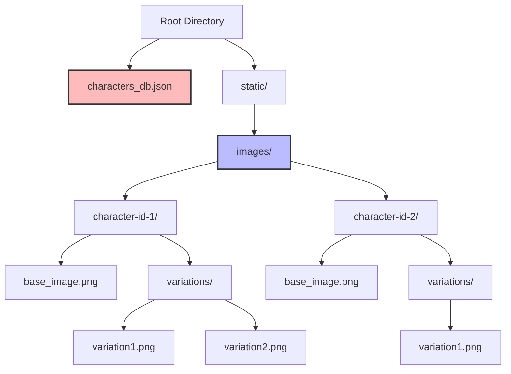

## Complete System Workflow

The full workflow when a user interacts with the system:

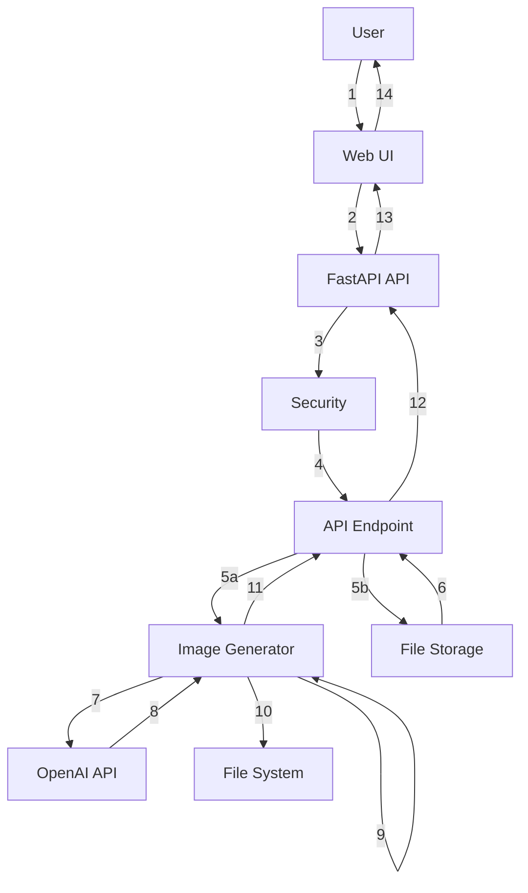

The numbered steps in the workflow:
1. User interacts with Web UI
2. Web UI sends request with API key to API
3. API validates the API key through Security
4. Security passes valid requests to API Endpoint
5. API Endpoint initiates:
   - 5a. Image generation
   - 5b. Data storage/retrieval
6. File Storage returns data to Endpoint
7. Image Generator calls OpenAI API
8. OpenAI API returns image URL
9. Image Generator downloads the image
10. Image Generator saves to File System
11. Image Generator returns image path to Endpoint
12. Endpoint returns response to API
13. API sends response to Web UI
14. Web UI updates display for User

## Conclusion

The Fictional Character Creator MVP follows a clean, modular architecture that separates concerns and maintains a clear flow of data. While using file-based storage for simplicity, the application implements secure API key validation and handles errors gracefully. The frontend provides an intuitive interface that communicates with the backend through a RESTful API.

For future improvements, the application could benefit from:

1. Moving from file-based storage to a database for better concurrency and performance
2. Adding user authentication for multi-user support
3. Implementing image caching and optimization
4. Adding automated tests for all components
5. Enhanced error handling and retry mechanisms for OpenAI API calls
6. Improved seed management for even better consistency across variations
7. Fine-tuning prompts for more precise control over character appearance 